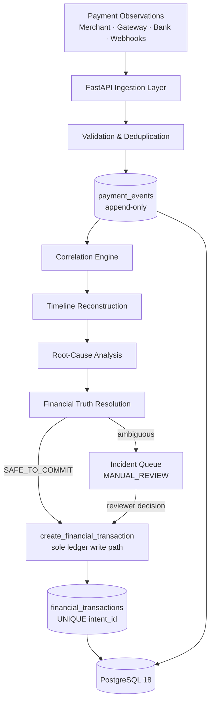

# VERITY

**A payment-truth and financial-failure intelligence engine — determining what's safe to commit to a ledger when payment systems disagree.**


> Built for the **BitNBuilt** hackathon — problem statement: *"The Payment That Happened Twice."*

---

## Table of Contents

- [Why VERITY?](#why-verity)
- [What VERITY Does](#what-verity-does)
- [Core Design Principles](#core-design-principles)
- [Architecture](#architecture)
- [Repositories](#repositories)
- [Backend](#backend)
- [Frontend](#frontend)
- [Payment Truth Resolution](#payment-truth-resolution)
- [API Reference](#api-reference)
- [Canonical Demo Scenario](#canonical-demo-scenario)
- [Running Locally](#running-locally)
- [Testing](#testing)
- [Security & Financial Safety](#security--financial-safety)
- [Design Decisions](#design-decisions)
- [Engineering Philosophy](#engineering-philosophy)

---

## Why VERITY?

Distributed payment systems rarely agree with each other in real time. A single customer payment can generate:

- **Duplicate events** — the same webhook delivered more than once
- **Delayed webhooks** — a confirmation arriving seconds or minutes after the fact
- **Out-of-order events** — arrival order that doesn't match when things actually happened
- **Network timeouts and retries** — a customer retrying a payment because the first confirmation never arrived, even though the bank leg succeeded
- **Conflicting provider states** — the bank says success, the gateway says failure, for the same attempt
- **Missing events** — an expected confirmation that never arrives at all

A naive system that treats "two successful-looking events" as "two payments" will double-count money that was never actually paid twice. VERITY exists because **`SUCCESS + SUCCESS = ₹4,000` is not a safe assumption** — it may just as easily mean one ₹2,000 payment, observed twice.

## What VERITY Does

Every incoming payment observation moves through one deterministic pipeline:

```
Payment Events
      ↓
  Validation
      ↓
 Deduplication
      ↓
 Persistence (append-only)
      ↓
 Correlation
      ↓
Timeline Reconstruction
      ↓
Root-Cause Analysis
      ↓
Financial Truth Resolution
      ↓
Ledger Safety Gate
      ↓
Audit / Reviewer Queue
```

At the end of that pipeline, VERITY produces one of two outcomes: a **safe commitment** to the financial ledger, or an explicit **refusal to guess** (`MANUAL_REVIEW`, `INSUFFICIENT_EVIDENCE`, `CONFLICTING_STATE`) — which is treated as a correct, successful result, not a failure of the system.

## Core Design Principles

| Principle | What it means |
|---|---|
| **Financial safety first** | Money is never committed to the ledger merely because an event *looks* successful. |
| **Deterministic financial decisions** | Financial state is resolved through fixed, testable rules — not a generative model. |
| **Evidence before commitment** | Every commitment is backed by evidence that passes an explicit sufficiency check. |
| **Safe refusal** | Ambiguous evidence produces `MANUAL_REVIEW`, not a guess. |
| **Idempotency** | Replaying the same event twice has zero additional financial effect. |
| **Auditability** | Every state transition and reviewer decision is traceable. |
| **Reproducibility** | Simulated scenarios are deterministic and byte-identical on replay. |

These map directly to the backend's enforced invariants:

| ID | Guarantee |
|---|---|
| **I1** | Idempotency — replaying duplicate events creates zero additional financial effects |
| **I2** | Deterministic simulation — `generate(scenario, seed)` yields byte-identical event sequences and resolutions |
| **I3 / I7** | Safe ambiguity — `POTENTIAL_DUPLICATE`, `CONFLICTING_STATE`, `INSUFFICIENT_EVIDENCE`, and `MANUAL_REVIEW` can never auto-create a financial transaction; safe refusal is a successful outcome |
| **I4** | One transaction per intent — enforced via a database `UNIQUE(intent_id)` constraint on `financial_transactions` |
| **I5** | Immutable events — `payment_events` is append-only |
| **I8 / I9** | Single ledger write path — only `create_financial_transaction(db, intent_id, attempt_id)` is authorized to write to `financial_transactions` |

## Architecture



VERITY ships as **two repositories**:

- The **backend** (FastAPI) owns every financial decision: ingestion, correlation, root-cause analysis, the truth-resolution engine, and the single authorized ledger write path.
- The **frontend** (Next.js) is the operator-facing surface for inspecting incidents and reviewing ambiguous cases — see [Frontend](#frontend) for its current status.

## Repositories

| Component | Repository |
|---|---|
| Backend | [Aivexh/VERITY-IN](https://github.com/Aivexh/VERITY-IN) |
| Frontend | [AlphaStorm-X/Verity](https://github.com/AlphaStorm-X/Verity) |

> The backend repository is not yet publicly browsable at the time of writing; the backend documentation below is sourced directly from the maintainer.

---

## Backend

**Stack**

| Layer | Technology |
|---|---|
| Framework | FastAPI (Python 3.13) |
| Database | PostgreSQL 18 |
| ORM | SQLAlchemy 2.0 |
| Migrations | Alembic |
| Validation | Pydantic v2 |
| Testing | Pytest + Hypothesis (property-based testing) |
| Containerization | Docker & Docker Compose |

The backend is the only component permitted to decide and record financial truth. Every route ultimately funnels through the correlation engine, the root-cause engine, and the financial truth resolver before anything reaches the database — and only one function, `create_financial_transaction`, may ever write a row to `financial_transactions`.

## Frontend

**Stack** (from `package.json`)

| Layer | Technology |
|---|---|
| Framework | Next.js 14.2 |
| Language | TypeScript 5.6 |
| UI runtime | React 18.3 |
| Styling | Tailwind CSS 3.4 |
| Server state | @tanstack/react-query 5.59 |
| Icons | lucide-react |
| Utilities | clsx, tailwind-merge |

**Status:** the frontend repository is currently a scaffolded Next.js application — project configuration, dependencies, and tooling are in place, but the operator-facing screens (dashboard, incident investigation, timeline, simulation controls) are still being built out. This README will be updated with actual screen documentation and screenshots as those land; see [Demo / Screenshots](#demo--screenshots) below.

> Screenshots coming soon.

---

## Payment Truth Resolution

VERITY tracks two ideas separately, on purpose:

- **Correlation** — how strongly two payment attempts *appear* related (order ID, customer ID, amount, timing, retry signals).
- **Financial resolution** — what VERITY is actually willing to commit to the ledger, given that correlation and the surrounding evidence.

An intent's aggregate state can land in:

```
SAFE_TO_COMMIT · POTENTIAL_DUPLICATE · CONFLICTING_STATE
INSUFFICIENT_EVIDENCE · MANUAL_REVIEW · HELD_FOR_REVIEW
```

Only `SAFE_TO_COMMIT` may reach the ledger automatically. Every other state routes to the incident queue for explicit reviewer action — the system will never resolve ambiguity by picking the more convenient answer.

## API Reference

| Method | Endpoint | Description |
|---|---|---|
| `POST` | `/api/events` | Ingest a raw payment observation / webhook |
| `GET` | `/api/events` | List ingested payment events |
| `GET` | `/api/transactions` | List committed financial transactions |
| `GET` | `/api/transactions/:id` | Get transaction or intent details |
| `GET` | `/api/transactions/:id/timeline` | Get the reconstructed chronological event timeline |
| `GET` | `/api/transactions/:id/analysis` | Get incident analysis & naive-engine comparison |
| `POST` | `/api/transactions/:id/explain` | Generate a natural-language explanation of the resolution |
| `GET` | `/api/incidents` | List financial incidents requiring review |
| `GET` | `/api/incidents/:id` | Get full incident detail |
| `POST` | `/api/incidents/:id/review` | Submit a reviewer decision (`CONFIRM_ATTEMPT` / `MARK_DUPLICATE`) |
| `POST` | `/api/simulations` | Create a simulation run |
| `POST` | `/api/simulations/:id/run` | Execute a deterministic simulation scenario |
| `GET` | `/api/dashboard` | Get dashboard exposure metrics and summaries |

## Canonical Demo Scenario

The clearest illustration of what VERITY does differently from a naive reconciliation approach:

```
Customer attempts payment
        │
        ▼
   ₹2,000 payment attempt
        │
        ├── Bank      → SUCCESS
        └── Merchant  → confirmation lost (network timeout)
        │
        ▼
   Customer retries
        │
        ▼
   Second ₹2,000 attempt
        │
        ├── Bank      → SUCCESS
        └── Gateway   → CONFIRMED
        │
        ▼
   VERITY Correlation → RELATED
        │
        ▼
   Financial Safety Gate
        │
        ▼
   POTENTIAL_DUPLICATE / MANUAL_REVIEW
```

Run it directly:

```bash
curl -X POST "http://localhost:8000/api/simulations/CANONICAL_DEMO/run?seed=42"
```

**Expected interpretation:**

| Metric | Value |
|---|---|
| Observed exposure | ₹4,000 |
| Candidate legitimate amount | ₹2,000 |
| Committed ledger amount | ₹0 |
| Aggregate state | `POTENTIAL_DUPLICATE` / `MANUAL_REVIEW` |

These four numbers are never interchangeable. **Observed exposure** is everything the raw evidence claims happened. **Candidate legitimate amount** is what the evidence suggests is the real payment. **Committed ledger amount** is what VERITY has actually decided is safe to record. The gap between the first and the third is the whole point of the system.

---

## Running Locally

### Backend

**Prerequisites**
- Python 3.13+
- PostgreSQL running on `127.0.0.1:5432` with a `verity_db` database created

```bash
git clone https://github.com/Aivexh/VERITY-IN.git
cd VERITY-IN

python -m pip install -r requirements.txt
cp .env.example .env

alembic upgrade head
uvicorn app.main:app --reload --port 8000
```

The API will be available at `http://127.0.0.1:8000`, with interactive docs at `http://127.0.0.1:8000/docs`.

### Frontend

```bash
git clone https://github.com/AlphaStorm-X/Verity.git
cd Verity

npm install
npm run dev
```

The app will be available at `http://localhost:3000`. (Note: as of now, this launches the scaffolded application — see [Frontend](#frontend) for current status.)

## Testing

```bash
pytest
```

Runs the backend's full suite: unit, integration, acceptance, canonical-demo, property-based (Hypothesis), and contract tests.

## Security & Financial Safety

- **Idempotency** — replaying an event, deliberately or accidentally, produces no additional financial effect.
- **Database-level uniqueness** — `UNIQUE(intent_id)` on `financial_transactions` is the final backstop against a double commit, even under concurrent writes.
- **Append-only events** — `payment_events` cannot be updated or deleted, preserving a trustworthy evidence trail.
- **Single ledger write path** — `create_financial_transaction(db, intent_id, attempt_id)` is the only function permitted to write to `financial_transactions`; no route, simulator, or explanation service can bypass it.
- **Safe failure** — when evidence is ambiguous or contradictory, the system defaults to `MANUAL_REVIEW` rather than an automatic commitment.

This is engineering-level financial safety for a hackathon build — not a claim of production compliance, certification, or audit readiness.

## Design Decisions

**Why deterministic rules instead of an ML/AI model deciding the financial outcome?**
Financial state has to be reproducible and explainable on demand. A rules-based resolver can be tested exhaustively (including with property-based tests); a model's decision boundary can't be proven the same way.

**Why allow `MANUAL_REVIEW` at all — isn't that avoiding the hard problem?**
Ambiguity is preferable to an unsafe financial commitment. A system that always resolves ambiguity by picking an answer will eventually pick the wrong one with real money attached.

**Why simulate payment failures instead of relying on real provider sandboxes?**
Duplicate events, delayed webhooks, and out-of-order delivery are difficult to reproduce reliably in an ordinary development environment. Deterministic, seeded simulation makes every failure mode reproducible on demand.

## Engineering Philosophy

VERITY treats payment reconciliation as a **financial-safety problem**, not merely a data-matching problem.

```
Observe → Correlate → Explain → Resolve → Safely Commit
```

When the evidence isn't there, VERITY says so — and that refusal is the product working as intended.
